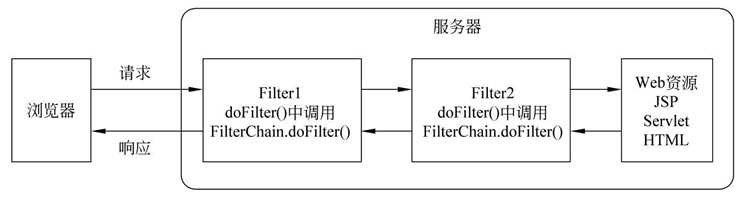

### 1，Build a servlet project

#### 1) 手动部署Servlet项目到Tomcat

不使用用IDE，手动部署Servlet项目到Tomcat，需设置classpath

找到Tomcat中的servlet-api.jar路径

例如：E:\Program Files\apache-tomcat-7.0.108\lib\servlet-api.jar

把以上Tomcat路径中的servlet-api.jar包配置到classpath环境变量当中即可

例: CALSSPATH=E:\Program Files\apache-tomcat-7.0.108\lib\servlet-api.jar;

#### 2) Build a servlet with Maven in Idea

[How to build a servlet wit Maven](https://medium.com/@backslash112/create-maven-project-with-servlet-in-intellij-idea-2018-be0d673bd9af)

### 2，Servlet源码及和Tomcat版本对应

因为Tomcat实现了Servlet，所以它的源码里也有Servlet的源码，下载Tomcat源码，使用idea映射即可

版本对应查询：https://tomcat.apache.org/whichversion.html

### 3，Tomcat项目的目录结构

项目放到Tomcat目录webapps下面

servlet-project01(项目根目录)
		|----html
		|----css
		|----javascript
		|----WEB-INF
				|----conf (配置文件，由ServletConttext中的方法可读取)
				|----classes (放Servlet代码编译成的xxx.class文件)
		        |----lib(放引用的外部 jar包)
				|----index.html/index.jsp(默认的欢迎首页)	
				|----web.xml （Tomcat的配置文件）	

访问方法：http://localhost:8080/servlet-project01 : 默认访问欢迎首页，可在web.xml里配置

### 4，Servlet的FilterChain

javax.servlet 包中提供了一个 FilterChain 接口，该接口由容器实现。容器将其实例对象作为参数传入 Filter 对象的  doFilter() 方法中。Filter 对象可以使用 FilterChain 对象调用链中下一个 Filter 的 doFilter()  方法，若该 Filter 是链中最后一个过滤器，则调用目标资源的 service() 方法。FilterChain 接口中只有一个方法，如下表。

| 返回值类型 | 方法                                                       | 描述                                                         |
| ---------- | ---------------------------------------------------------- | ------------------------------------------------------------ |
| void       | doFilter(ServletRequest request ,ServletResponse response) | 使用该方法可以调用过滤器链中的下一个 Filter 的 doFilter() 方法，若该 Filter 是链中最后一个过滤器，则调用目标资源的 service() 方法。 |

>  在 Filter.doFilter() 方法中调用 FilterChain.doFilter() 方法的语句前后增加某些程序代码，就可以在 Servlet 进行响应前后实现某些特殊功能，例如权限控制、过滤敏感词、设置统一编码格式等。

多个Filter的执行流程，结合个人代码理解：

参考：http://c.biancheng.net/view/4031.html

http://c.biancheng.net/servlet2/filterchain.html

