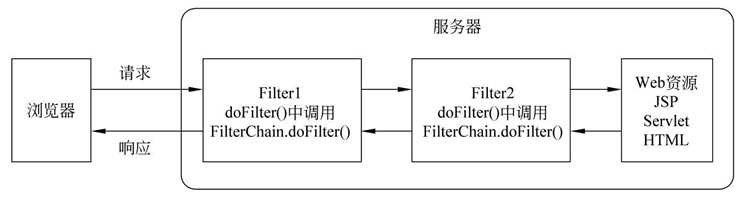

### 1，Servelt的FilterChain

javax.servlet 包中提供了一个 FilterChain 接口，该接口由容器实现。容器将其实例对象作为参数传入 Filter 对象的  doFilter() 方法中。Filter 对象可以使用 FilterChain 对象调用链中下一个 Filter 的 doFilter()  方法，若该 Filter 是链中最后一个过滤器，则调用目标资源的 service() 方法。FilterChain 接口中只有一个方法，如下表。

| 返回值类型 | 方法                                                       | 描述                                                         |
| ---------- | ---------------------------------------------------------- | ------------------------------------------------------------ |
| void       | doFilter(ServletRequest request ,ServletResponse response) | 使用该方法可以调用过滤器链中的下一个 Filter 的 doFilter() 方法，若该 Filter 是链中最后一个过滤器，则调用目标资源的 service() 方法。 |

>  在 Filter.doFilter() 方法中调用 FilterChain.doFilter() 方法的语句前后增加某些程序代码，就可以在 Servlet 进行响应前后实现某些特殊功能，例如权限控制、过滤敏感词、设置统一编码格式等。

多个Filter的执行流程，结合个人代码理解：

参考：http://c.biancheng.net/view/4031.html

http://c.biancheng.net/servlet2/filterchain.html